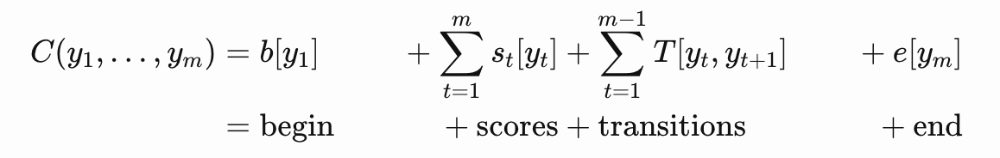
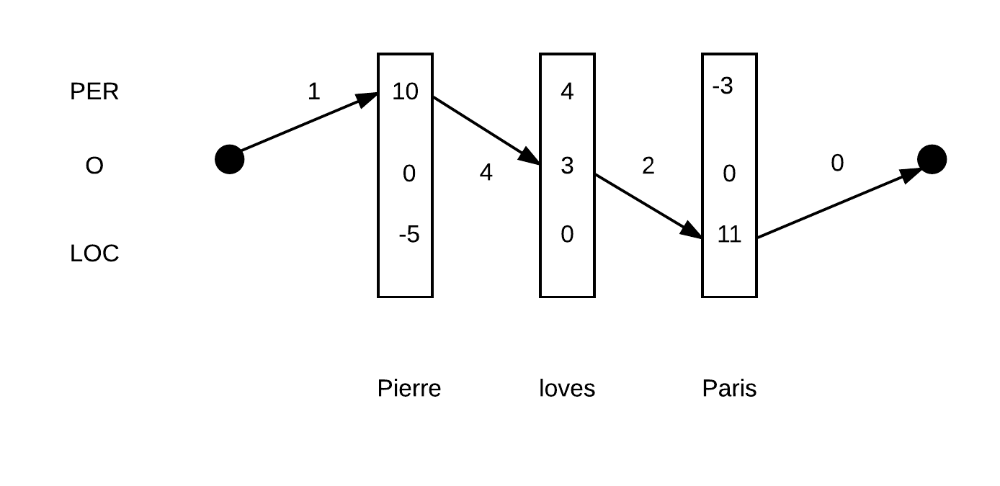
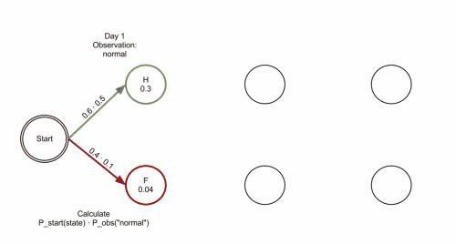
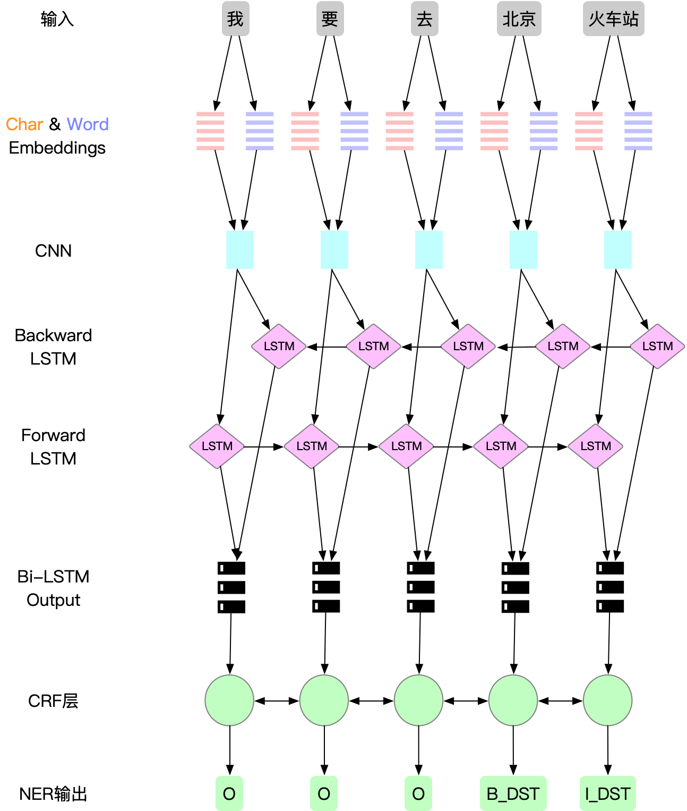

# 1.概述

自然语言理解（NLU：Natural Language Understanding）是人工智能的核心难题之一，也是目前智能语音交互和人机对话的核心难题。


在语音助手的这一类产品中，能够准确理解用户的输入信息，是非常重要的，通过对于用户输入信息的组织与抽取，将其转换为程序能够正确是别的结构化信息，才能给与用户准确的反馈，而在这个过程当中，意图检测（intent detection）和槽位填充（slot filling），是其中的基础的工作。


**意图检测（intent detection）**：意图检测的目的，是判断用户的输入是想要做什么。比如，当用户说：“今天天气怎么样”，这里的意图就是查询天气。“我要去万达广场”，这就是一个导航的意图。


**槽位填充（slot filling）**：槽位填充，就是将用户输入的信息中，根据我们既定的一些结构化字段，将其提取出来，这样可以对后续的处理流程更加准确的给与反馈。还是上面的例子，“今天天气怎么样”，可以提取出一个时间的slot，这里就是“今天”，“我要去万达广场”里面的含有一个地点的slot, 这里就是“万达广场”。slot与具体的任务有密切的关系。


这样，我们就可以根据提取的意图和槽位，来查询云端的服务，然后云端反馈给用户所需的信息，这里的intent相当于一个云端接口，而slot就是这个接口对应的参数，比如“今天天气怎么样”，就会向查询天气的接口发送请求，参数中的日期是今天的时间，最后该接口就返回今天的天气信息给到用户。当然，具体到真实的语音助手的交互流程，会比这里更复杂，考虑的细节也会更多，这里只是简单的说一下方便理解。


本次，将主要介绍一下**槽位填充（slot filling）**相关的一些内容。

------

**命名实体识别（NER：Named Entity Recognition）**，又称作专名识别，是指识别文本中具有特定意义的实体，是自然语言处理(NLP)领域的基础任务之一。传统的NER任务主要包括识别人名、地名、机构名、专有名词等，以及时间、数量、货币、比例数值等文字。


槽位填充（slot filling）可以认为是对传统NER任务的扩展，是更加广义上的NER，可以对具体的域（domain：intent之上的类别，如音乐域有播放音乐，暂停音乐等不同的intent）里面定义具体的类别，比如导航域中的POI，音乐域中的歌手以及歌曲，专辑等等，都是对于特定域中的的实体，所以我们在这里slot filling所应用的技术，与业界在NER任务当中所使用的技术是一致的。

# 2.摘要

对于机器学习任务来说，数据和算法同等的重要，在后文中会主要分两部分来讲，先讲数据，再讲算法（模型）

# 3.数据

在这一节，会主要介绍，数据准备，数据标注，特征工程，以及一些tips。

### 3.1 数据准备

我们这里的训练数据主要是两部分

1. 众包数据：众包数据是根据任务具体到细化的意图收集回来的用户QUERY
2. 用户数据：用户以前在使用过程中真实输入的语句，将与本任务相关的收集而来

### 3.2 数据标注

在我们的模型训练之前，并没有一份能够适用于我们现有业务的标注好的数据，所以我们需要根据我们的数据，自行对数据做相应的标注

#### 3.2.1 标注方式

这里的数据标注主要用BIO（Begin, Intermediate, Other）标注方式来做标注，下面举例说明：

```
字符粒度：导(O)航(O)到(O)天(B_POI)安(I_POI)门(I_POI)
分词粒度：找(O)一下(O)回家(B_HOME)的(O)路线(O)
```

具体使用哪种粒度，需要根据业务自行选择，各有相应一些优缺点

#### 3.2.2 标注方法

1. 众包数据：可以认为是半结构化数据，数据中提供了句子中对应的POI信息，可以比较容易的通过脚本抽取然后对其做相应的标注，但是对于一些其他的属性，比如是否躲避拥堵则没有提供，这里需要重新标注，标注方法与后面介绍的用户数据中使用的一致。	
2. 用户数据：用户数据是完全不带标注信息的，我们要做的工作就是将用户QUERY标注为我们需要的格式，下面将主要对这一部分做介绍。

##### 3.2.2.1 匹配方式

对于序列数据标注，最常用的办法是使用**字符串最长匹配**，也就是找出在我们字典中能找到的最长的子句。


如，对于一个QUERY“我要去北京天安门”，在我们的字典中，同时匹配到“北京”、“天安门”、“北京天安门”等三个词，那么我们需要选择其中最长的那个，也就是“北京天安门”，我们最终会将其标注为以下的形式

```
导(O)航(O)到(O)天(B_POI)安(I_POI)门(I_POI)
我(O)要(O)去(O)北(B_POI)京(I_POI)天(I_POI)安(I_POI)门(I_POI)
```

##### 3.2.2.2 匹配算法

这里就涉及到字符串多模匹配的问题，也就是在一个字符串中，同时匹配在字典中的所有子串，在这里使用了AC自动机算法（即：**Aho–Corasick**算法），这个算法在这里就不做详细介绍了，网上有大量的资料对此作了详细的说明，我们需要知道的是这个算法对于字符串多模匹配的任务来说，有近似线性的时间复杂度，效率很高就好了，这个算法的python实现在[这里](https://pypi.org/project/pyahocorasick/)。

##### 3.2.2.3 字典生成

OK，到这里，我们已经知道该怎么找到需要标记的子串了，那么有另外一个问题，字典在哪里来呢，到目前为止，我们并没有一个能够可用的字典，这里你可能会想，我可以在网上爬取，或者从其它方式拿到这样一个字典，不能说这样做不可以，只是可能会没那么快，另外即使拿到了可能也需要大量的工作对其进行处理才能使用，我们在这里用一个简单的办法，迅速的先生成了一批可用的高质量POI字典。

1. 选取用户query中的高频query，例如出现次数大于3的，说明不止一次出现过这个句子，是用户随心所欲或者错误的输入句子的概率较低
2. 找到其中的一些固定的模式，比如，导航到POI，我要去POI，找到这种模式的query，提取后面的POI，将其放到字典中。
3. 根据这批种子的POI字典，通过上面的最长匹配的方法，标注一批数据，这样可以通过高频模式提取的准确字典，标记出其他低频模式中的POI信息，然后用单机的[CRF++](<https://taku910.github.io/crfpp/>)，来训练一个单机的CRF模型，找到这个低频的模式，然后使用这个模型来对其他的不在模式内的句子进行识别，识别出其中的POI，这样我们又获得了一批POI，将其加入字典中（在这里也可以用神经网络的模型代替CRF++，只是神经网络可能比较慢，迭代起来会比较耗费时间）
4. 重复前面的过程，标注数据，训练模型，识别POI，加入词典，直到我们能够找出覆盖率高，准确率也较高的词典，然后我们在将此字典的基础上，对全部的数据进行标注，用于后面的神经网络模型训练。

#### 3.2.3 TIPS

这里在用脚本对query做标准的过程中，有几个注意的点，会增加对于数据标注的准确率，以及创造更多的适用于训练的数据集

- 标注拼接：对如“我要去北京天安门”的例子，可能在字典中，只有“北京”，“天安门”两个POI，而没有“北京天安门”，如果不做拼接，标注是这样的


```
我(O)要(O)去(O)北(B_POI)京(I_POI)天(B_POI)安(I_POI)门(I_POI)
```

而拼接了之后应该是这样的,这样是更准确的标注

```
我(O)要(O)去(O)北(B_POI)京(I_POI)天(I_POI)安(I_POI)门(I_POI)
```

- 后缀扩展：对于“美丽家园小区23号楼”这种POI，我们的词典中，可能只包含“美丽家园小区”，在这里我们需要对23号楼这种表述做相应的扩展，才能让标注有更加的准确，在这里主要是收集了一批后缀词，然后对于形式如（POI + 数字 + 后缀词）的这种组合，自动的对扩展后缀词。


- 众包数据增强：众包数据整体句式形式多，质量较高，所以对众包数据做相应的增强，提高整体在训练数据集合中的比重，让模型找到众包的模式，增加的拟合能力，具体的做法就是将众包POI替换为字典中的POI，同时将众包的数据替换后的数据量增加，这样防止模型将POI识别为模式，通过替换不同的POI让模型更加泛化，适应能力更强


- 负例数据：负例数据主要来源于与当前模型不同的域，比如我现在训练的是导航域的模型，那么负例就是来自于音乐，广播等其他域的数据，将其他域的数据都标记为O，数据量与正例相当即可


### 3.3 特征工程

虽然说在深度学习时代，对于特征工程的工作来说，已经大为的简化了，但是从实际来看做好前面的工作对于任务来说仍然是一种提升模型效果非常有效的手段

- 数字：对于query中的数字，统一处理为一个标记符，如\_NUM\_，形式类似于\_UNK\_（代表未登录词汇）
- 英文：统一处理为小写
- 分词：使用统一的分词方式对训练模型，以及线上的应用做分词，同时使用该分词方式做分词来生成预训练的词向量，而不是使用网络下载的其它分词方法生成的词向量。
- 预训练词向量：使用预训练的词向量可以快速提升模型的拟合能力，尤其在训练数据较少的情况下，使用预训练词向量是一个更好的选择，现在词向量的解决方案有很多，主要有glove、fasttext和word2vec几种，在实际的使用过程中，经评估，使用fasttext 略好与glove，二者效果明显好于word2vec，同时也好于在模型中自训练词向量（即不适用预训练词向量）（但是理论上当训练数据量足够大的情况下，此种方式可能更优）

# 4.模型

### 4.1 主要模型方法

NER是一个序列标注（Sequence labeling，中文分词，词性标注等都可视为序列标注问题）的问题，所以可以应用在序列标注方面的算法，都可以应用在命名实体识别识别方面。

序列标注问题可以简单理解为，对于一段序列，X={x1，x2，...，xn}，我们需要对其中的每一个xi标注一个tag、对于分词问题，这个tag就是词起始，可以用上面的B，I等标签来标识，对于词性标注问题，tag就是名词，动词，形容词等标签，对于命名实体识别问题，就是对应词的类别，如时间，地点等。

举例来说，如果有一段文本序列：我要吃苹果

对于中文分词，我们会标识为:`我(S)要(S)吃(S)苹(B)果(I)`(S在这里代表single)

对于词性标注，我们会标识为:`我(S-n)要(S-v)吃(S-v)苹(B-n)果(I-n)`

对于命名实体识别，我们会标识为:`我(O)要(O)吃(O)苹(B-FRUIT)果(I-FRUIT)`


在对于序列标注问题的处理上，主要是使用基于概率图的传统模型，以及现今用的较多的基于神经网络的模型。

- 传统模型：隐马尔科夫模型(HMM) -> 最大熵马尔科夫模型(MEMM) -> 条件随机场(CRF)
- 神经网络：RNN/LSTM/CNN+CRF -> BiLSTM+CRF->BiLSTM+CNN+CRF

### 4.1 传统模型

在传统模型里，因为CRF的效果比HMM效果好很多，在深度学习流行之前，序列标注任务几乎都是CRF的天下，另外在我们后面介绍的神经网络结构中，也是用了CRF作为网络的一层，所以我们对CRF做一下简单介绍。

#### 4.1.1 条件随机场(CRF)

这里的CRF主要指的是线性链条件随机场(linear-chain CRF)


简单来说，CRF就是根据当前词以及前一个词，生成一系列的特征函数，通过这些特征函数来计算出一系列的参数矩阵，通过这样一批参数矩阵，刻画出各个词之间的权重关系，然后通过这些权重，在输入序列的每个位置上计算得分，最后汇总各个部分求解全局整体的最优分数。


比如：对于一个句子来说，出现在“非常”这个词后面的词，很大概率是一个形容词，这样非常就能够刻画出“非常”与目标形容词之间的强列关系，从而赋予一个比较高的权重，而对于出现在的“非常”后面名词，则就不会有形容词那么高的权重。


给了一个序列如 w1,…,wm，一个分数向量序列如s1,…,sm，一个标签的序列y1,…,ym，一个linear-chain CRF定义了一个实数域的全局分数C，那么实数C定义为。



其中T为实数域内的转移矩阵，e和b是一个给定的开始和结束标签的实数域内的分数向量，矩阵T用于捕获标签（单步）之间的线性依赖关系。




```
对于上图来说路径PER-O-LOC可以算出如下分数1+10+4+3+2+11+0=31
```


```
而路径PER-PER-LOC则会计算出如下分数1+10+2+4−2+11+0=26
```


所以，如果上面的结果不考虑词与词之间的关系的话，那么我会会选择第二条路径作为最终的结果，而使用了词与词之间的转移矩阵我们最终会使用第一条PER-O-LOC链路，从而让整个的标注更加准确。

那么，我们使用CRF算出了各个权重，怎样找出最优的序列呢？

#### 4.1.2 维特比算法(Viterbi algorithm)

注意：维特比算法并不是一种用于序列标注的算法。而是一种动态规划算法，用于寻找最有可能产生观测事件序列的维特比路径。


简单来说，viterbi算法其实就是多步骤每步多选择模型的最优选择问题，其在每一步的所有选择都保存了前续所有步骤到当前步骤当前选择的最优解。直到计算到最终状态，选出其中的最优解，通过该最优解，进行前面序列的状态回溯，找到最终推断的状态序列。


简单过程可以参考下图，其中，红色为各个步骤所选出出来的最优解，通过最后一个节点的最优解，我们可以反推前面所经过的节点。





### 4.2 神经网络模型

神经网络模型是现今在使用较为广泛的方法，我们会做主要介绍BiLSTM+CNN+CRF，其他模型只是相应的少了部分的层，模型的拟合能力略有差异，明白了BiLSTM+CNN+CRF，其它的也是一样的道理。

#### 4.2.1 输入层

使用分词工具对输入句子做分词，然后将分词结果组成新的序列输入到下一层，当然这里也可以不使用分词，而只使用字来做序列标注，那么就直接将原始的句子拆分为字序列输入即可。

#### 4.2.2 Embedding层

使用输出词对应的预训练词向量作为词表示，同时拼接上组成该词的字向量表示，字向量表示可通过对各个训练的字向量取pooling而来，也可加入一个BI-LSTM测训练而来，后者使用其state输出，与前面的词向量拼接起来，共同组成输入特征（batch_size，timestep,  feature）

#### 4.2.3 CNN层

通过一维卷积神经网络conv1d对输入的Embedding表示做一维卷积，通过做一维卷积操作，可以从局部输入中提取特征，识别序列中的局部模式，通过对每个序列段执行相同的输入变换，所以在句子某部分学习到的模式可以在后面的其他位置被识别，使得一维卷积神经网络具有平移不变性（时间维度），从而提升整个网络的识别能力。（CNN在该网络中主要贡献在于对局部尺度特征进行提取）

#### 4.2.2  Bi-LSTM（双向LSTM）

Bi-LSTM是一种LSTM的变体，被称为深度学习在自然语言处理任务的瑞士军刀，其通过在正序和倒序两个方向上对文本序列做相应的处理，同时捕获两个方向上的序列特征，然后将二者的表示合并在一起，从而捕获到单向LSTM可能忽略的模式，在该网络中，Bi-LSTM层接收CNN层的输出，将其转换为固定长度的隐层向量表达 (batch_size，timestep, lstm_output_feature_map)（Bi-LSTM在网络中主要贡献在于对序列中长期模式的特征提取）

#### 4.2.3  CRF层

CRF层结合前面LSTM层的输出，学习到LSTM层输出结果各个序列的转移矩阵参数，然后通过维特比算法计算得到最优序列，最终将其映射为对应的标签。这里的CRF与传统模型中的类似，在传统模型中，计算的是词与词之间的转移矩阵，在这里计算的是各个词经过前面的CNN层和BiLSTM层计算后所得出的隐含表示之间的转移矩阵。

### 4.3 神经网络结构图





### 4.4 用keras实现一个简单的BiLSTM+CRF模型

Keras 是一个用 Python 编写的高级神经网络 API，它能够以 [TensorFlow](https://github.com/tensorflow/tensorflow), [CNTK](https://github.com/Microsoft/cntk), 或者 [Theano](https://github.com/Theano/Theano) 作为后端运行。Keras 的开发重点是支持快速的实验。能够以最小的时延把你的想法转换为实验结果，是做好研究的关键。

下面我们用Keras来根据以上的网络结构实现一个简单的模型。

```python
import keras
from keras import Sequential, layers
from keras_contrib.layers import CRF

model = Sequential()
#加入embedding层
model.add(layers.Embedding(len(vocabs), embedding_dim, mask_zero=True))
#BI-LSTM层，输出的大小为lstm_size，返回全部序列，而不是lstm的最后一个序列
model.add(layers.Bidirectional(layers.LSTM(lstm_size, return_sequences=True)))
#加一个crf层，注意CRF不在keras基础包中，需要包含keras_contrib
crf = CRF(len(tags), sparse_target=True)
model.add(crf)
model.summary()
#将embedding层设置为预训练词向量
model.layers[0].set_weights([embedding_matrix])
#将预训练词向量设置为不可训练，防止模型更新导致词向量偏差，效果变差
model.layers[0].trainable = False
#编译模型
model.compile('adam', loss=crf.loss_function, metrics=[crf.accuracy])
#在训练集上训练，在验证集上验证
model.fit(x_train, y_train, epochs=10, batch_size=64, validation_data=[x_valid, y_valid])
```

### 4.5 收尾

好吧，这里来收个尾，现在来说，序列标注问题已经在神经网络的加持下，已经取得了非常不错的效果，像是在很多的公开测试数据集上已经达到了90%以上的准确率，这个准确率也在各种新的技术下被不断的打破，如昨天Google在其发表的新论文中，BERT模型打破了11种不同的NLP测试任务，其中也包含NER。正如谷歌团队的Thang Luong所说：**BERT模型开启了NLP的新时代！** , 有兴趣的可以围观一下，[论文地址](https://arxiv.org/abs/1810.04805)。

### 4.6 参考资料

##### [概率图模型体系：HMM、MEMM、CRF](https://zhuanlan.zhihu.com/p/33397147)

##### [一个很好的序列标注实现](https://github.com/guillaumegenthial/sequence_tagging)

##### [使用TensorFlow做序列标注](https://guillaumegenthial.github.io/sequence-tagging-with-tensorflow.html)

##### [CRF介绍](http://blog.echen.me/2012/01/03/introduction-to-conditional-random-fields/)
