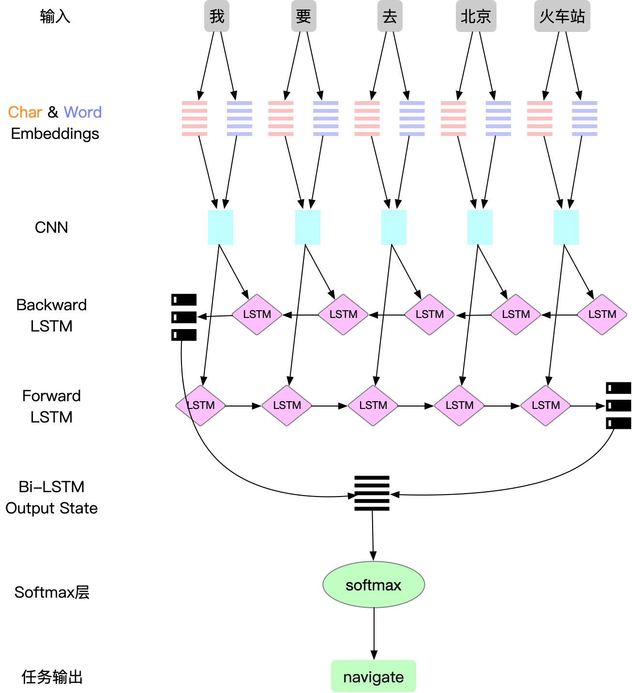
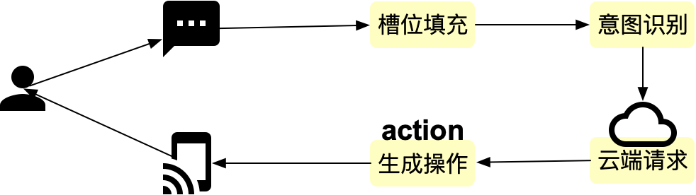

# 1.概述

上一篇中，[槽位填充](01_slot_filling.md)，我们介绍了一下在自然语言理解（NLU：Natural Language Understanding）的过程中所面临的两个问题，分别是意图检测（intent detection）和槽位填充（slot filling），尤其对槽位填充做了详细的介绍，在本文中，会接着介绍一下意图检测（intent detection）。

**领域**是指同一类型的数据或者资源，以及围绕这些数据或资源提供的服务，比如天气，音乐，电台，导航，等。

**意图**指的是在具体的领域下，对于领域的各种操作，比如，在音乐领域，可以有播放音乐，暂停音乐，加入收藏夹等等。

**意图检测（intent detection）**要做的就是确定用户输入的指令属于哪一个领域的哪一种意图。

根据领域以及意图，我们结合对应的槽位信息，我们就可以向云端或设备（有些不需要去云端请求）发出相应的处理请求，然后云端或设备将其转换为具体的action，来执行相应的操作，完成用户指令。

# 2.摘要

意图识别从技术上来说，并不是一个复杂的问题，因为所有的意图都是在我们定义的领域之下已经定义好的，其他不在定义内的意图，可以统一的归类为未知(unknown)，有过相关经验的朋友可以看出，这是一个多元分类（multi-class classification）的问题。

同样的，我们会分两部分对这个问题来做阐述，数据和模型

# 3.数据

前文说过，我们的数据来源于两部分，众包和用户输入，那么，我们需要做的，就是对这两部分数据打标。

### 3.1 众包数据

对于众包数据来说，这个问题相对来说比较简单，因为我们的数据在收集的过程中，就是根据intent来收集的，所以批量根据收集任务，对其做相应的标注即可。

### 3.2 用户数据

用户数据这部分就会比较麻烦，这里也没有一些更好的实践，主要是根据在众包数据中找到各个意图的的模式，比如，导航到xxx，一般就是导航的意图，然后根据这些模式的关键字，检索出匹配的query，然后将其设置为相应的intent。另外一个就是根据前文中槽位填充的结果来识别相应的意图，因为在槽位的结果中，我们已经可以识别出相应的实体类型，我们可以根据实体的类型，来对query做相应的辨别，最终找出一批可靠的query，用于做训练数据。

其他的对于数据的一些处理，前一篇已经做了详细的介绍，这里的处理与其类似，请参考前文，这里不再赘述。

# 4.模型

### 4.1 主要模型方法

在前面的叙述中，我们可以确定意图识别是一个多分类问题，那么相应的，我们使用一个多分类的模型来做对应的处理。

**分类问题**是机器学习的基本问题，与其对应的还有回归，聚类等等。

而分类问题中，又可以根据目标的不同，分为二分类问题和多分类问题。

**二分类**就是一共有两个类别，一般我们会将其定义为正和负（即1和0），一般情况下我们会通过机器学习算法将高维输入数据划分出一个超平面，然后根据这个超平面将其划分为两类，通过超参数与输入数据，可以将其输出映射为0到1之间的一个概率值，根据这个概率值，我们将其分类为0和1，比如大于0.5的将其定义为1，小于0.5的定义为0。传统的算法主要是逻辑回归（LR：Logistic regression），支持向量机（SVM：support vector machine）等。

**多分类**就是在目标是多于2个以上的类别，就是说，对于一个任务，有多个目标可能，我们需要在这多个目标中选择与其相匹配的目标。而根据目标选择是否唯一，又可以分为**多元分类（multi-class classification）**和**多标签分类（multi-label classification）**，其主要的区别在于。

多元分类：每一个输入，只有一个输出标签，比如说有一个水果分类器，一个水果只能对应一种类别，它只能是苹果，梨子，香蕉，或者其他。
```
多元分类（multi-class classification）问题的主要是使用Softmax回归来解决，Softmax 回归是直接对逻辑回归在多分类的推广，相应的模型也可以叫做多元逻辑回归（Multinomial Logistic Regression）
```
多标签分类：每一个输入，可能有多个输出标签，比如说新闻的分类，一条新闻，可能同时是包含经济，政治，军事等内容，对于这条新闻来说，就有这三个标签，也就同时属于这三个类别。

```
多标签分类（multi-label classification）的问题主要是使用one-vs-rest的方法：简单来说，就是对于候选类别中的每个类，构建一个二元分类器，然后属于该类别的为正例，否则为负例，然后通过对所有类别做一个预测，选择其中类别为1的所有结果。
```
在我们的场景下，尽管有些用户输入的query可能包含多个意图，比如：我要去某地同时播放歌曲，就同时包含了导航和音乐的意图，但是我们在此并不会多做讨论，这个问题会使用其它的方式来解决。所以我们就将此问题作为多元分类的问题来解决。

### 4.2 传统模型

通过上面的介绍，我们可知，对于多元分类问题，可以用softmax回归来解决，softmax回归是在逻辑回归上面的扩展，将两个类别输出扩展为多个类别。（注：虽然名为回归，但该算法解决的的确是分类问题，通过将输入映射到0-1之间的一个概率值作为分类的依据）

其中softmax函数是一种归一化的函数，并且将其转换为各个类别上的一个0-1之间的概率值，其中所有的概率加和为1。其使用python的代码可以表示为：

```python
import numpy as np
z = np.array([1.0, 2.0, 3.0, 4.0, 1.0, 2.0, 3.0])
print(np.exp(z)/sum(np.exp(z)))
#[0.02364054 0.06426166 0.1746813 0.474833 0.02364054 0.06426166 0.1746813 ]
```

### 4.3 神经网络模型

对于多分类的模型，主要根据输入数据的不同选择不同的网络结构，比如图片类数据，cnn+softmax能够更好的处理，而我们的任务是文本，是一个nlp问题，前面也说过了，bilstm对于处理nlp任务非常在行，另外也是为了复用之间的一些工作，所以，在这里我们对于这个任务，会使用bilstm+softmax的结构，其中输入，embedding，bilstm层等与上一文当中的介绍是一致的，这里不做赘述，着重介绍其中差异的部分。

#### 4.3.1 Bi-LSTM（双向LSTM）

这里Bi-LSTM层的功能与上文中是相同的，这里的一个不同点就是，这里使用的输出是前向LSTM的最后一个输出和后向LSTM的最后一个输出，然后将这两个concat在一起作为下一层的输入，而不是像上一个任务一样使用的是每一个节点的状态，主要是因为，对于序列标注任务来说，我们需要知道每一个序列上的状态，然后根据这个状态以及其相邻序列的状态，对其进行标注，而对于多分类任务来说，我只要获得一个能够代表整条语句信息的输出即可，而LSTM的最后一个状态已经包含了整条语句的信息，所以我们只需使用这最后的状态输出即可。

#### 4.3.2 SoftMax层

SoftMax层从Bi-LSTM得到的句子隐层状态，然后通过一个Projection层将其从高维的隐层状态，通过一个权重矩阵将其映射到与输出类别个数一致的向量当中，这个向量代表了各个类别的输出。然后通过softmax函数将这个向量转换为其中各个类别的概率，最后我们选择其中概率最高的类别，就是我们最终需要输出的结果。

#### 4.3.3 神经网络结构图




### 4.4 用keras实现一个简单的多分类模型

```python
import keras
from keras import Sequential, layers

model = Sequential()
#加入embedding层
model.add(layers.Embedding(len(vocabs), embedding_dim, mask_zero=True))
#BI-LSTM层，输出的大小为lstm_size，返回全部序列，而不是lstm的最后一个序列
model.add(layers.Bidirectional(layers.LSTM(lstm_size)))
#添加一个激活为softmax的Dense层，同时完成projection和softmax的工作
model.add(layers.Dense(len(classes), activation='softmax'))
#获取网络的层次结构信息
model.summary()
#将embedding层设置为预训练词向量
model.layers[0].set_weights([embedding_matrix])
#将预训练词向量设置为不可训练，防止模型更新导致词向量偏差，效果变差
model.layers[0].trainable = False
#编译模型,categorical_crossentropy作为loss function
model.compile('adam', loss='categorical_crossentropy', metrics=['accuracy'])
#在训练集上训练，在验证集上验证
model.fit(x_train, y_train, epochs=10, batch_size=64, validation_data=[x_valid, y_valid])
```

### 4.5 收尾

好，介绍到这里我们可以知道，从自然语言理解的两个基础任务，槽位填充和意图识别的做法，然后，我们就可以通过一个流水线系统将其二者联系起来，从而形成一个闭环，完成整个使用流程。

如下图所示：



