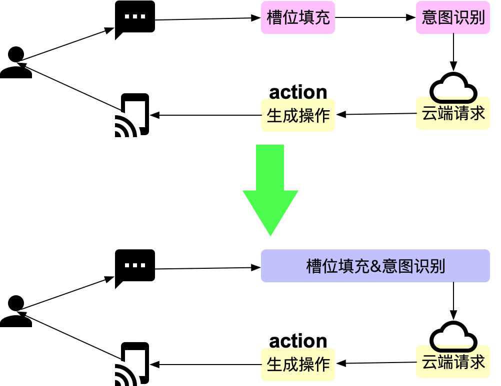
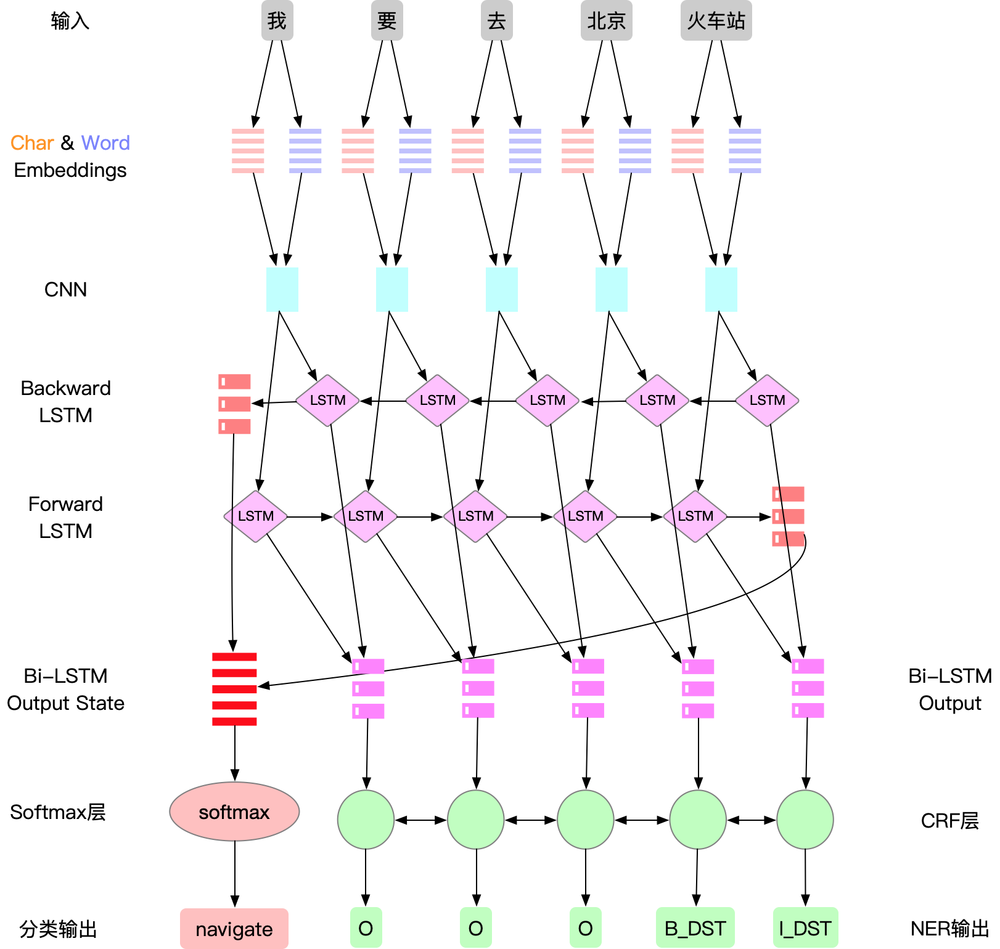

目前需要对多人做相应的补充，同时对模型做一定的输出
## 1.联合学习
在前文中，我们通过两个模型分别处理了槽位提取和意图识别，然后通过**流水线的方式（Pipelined Method）**，将两个任务串联在一起，完成了整个流程，在这个过程中，我们可以发现，两个模型的输入是完全一致的，即都是用户输入的query，同时，两个任务也有非常强的联系。

那么我们在这里会问，我们这两个步骤既然输入一样，那么能否将其合二为一呢，即做到一个输入，多个输出，让我们的模型能够一步到位，直接输出我们所有步骤的结果呢？

答案是肯定的，在本文中，我们将会介绍一下怎样将前两篇文中介绍的各自独立的模型进行**联合学习（Joint learning）**。整合为一个统一的**联合模型（Joint model）**。

## 2.联合学习的优势

1. 一个显而易见的优点就是整个流程中的模块减少了，模块的减少意味着上下游的联调，跨模块调用，以及信息传递的步骤会有所减少，而这对于一个多模块的系统来说，开发的工作量，系统的耗时，可以在整体上降低。

2. 联合学习省去了部分独立学习任务所需要做的数据标注工作，我们可以在同一个数据集上做一次处理即可。

3. 对于流水线模型，每个模型都是在自己的任务上求得一个最优解，然后将其串联起来，但是各个模型之间的优化目标是分裂的，每个独立任务的最优解在整体的目标上不是全局最优的。

   另外这些看似不相关的任务之间是存在一些信息重叠的，联合模型可以访问比仅针对该特定任务训练的模型更多的关于每个单独任务的信息。比如通过槽位中的信息，可以对意图识别任务有正向的帮助，而流水线的方式没有办法利用这里更隐层的信息，相比流水线模型，联合学习具有协同增效的优势，可以比单任务学习获得更好的泛化效果。

4. 节约资源，在联合模型中，可以共享部分的网络结构，所以在模型训练的过程中，共享的网络层经过训练会对多个任务同时生效，另外在应用上线后，联合模型也可以比流水线模型节约线上的机器资源。

## 3.联合模型的结构

## 4.联合模型的学习

从上图的结构中看，联合模型与之前流水线的模型差别在于，流水线模型只有一个输出，而联合模型同时输出了两种结果，两个任务同时共享BI-LSTM层及之前层次的参数。这样可以共享二者的隐藏层的一些信息，互相协同影响对方的识别能力。

在这里，槽位提取任务和意图检测任务，分别有一个损失函数loss1和loss2，那么我们在训练的时候，只需要将二者的损失函数加在一起，然后训练最终的和，即loss=loss1+loss2就可以了。

这是一种简单有效的手段，最终经过多次的迭代，模型最终会收敛到二者在整个网络上的最小值，让整个模型达到最优化。

